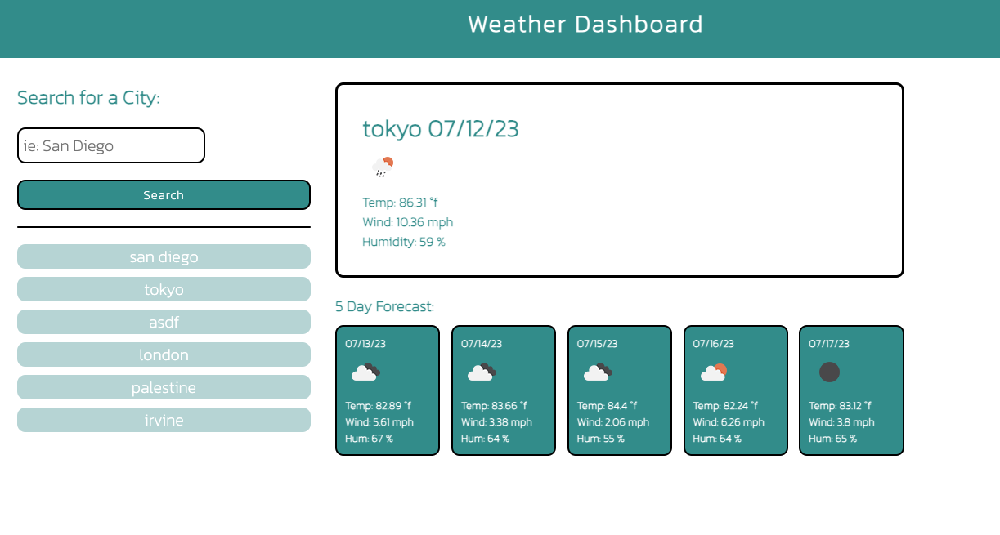

# weather-app

## Description
    This my first project where I used and implemented server side api's!
    In this simple 5 day forecast weather app, the user can submit a city name
    and a 5 day forecast will be dynamically generated using openweathermap's api (linked below).
    
## Technologies
    HTML/CSS/JavaScript/jQuery
    Open Weather's api: 
https://openweathermap.org/forecast5
## Credits
    Thank you to UC Berkeley Extension Full Stack course, partnered with EDX, for the starte code.
## Screenshot

## Link to Application

[Visit my deployed application!](https://lopez-jordan.github.io/weather-app/)
